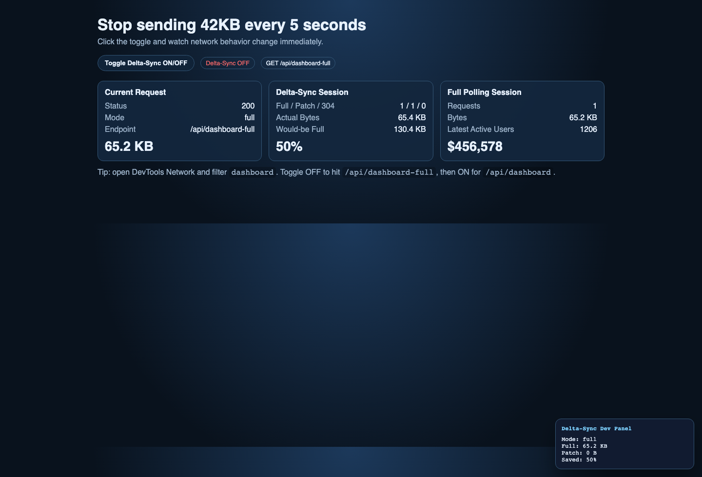
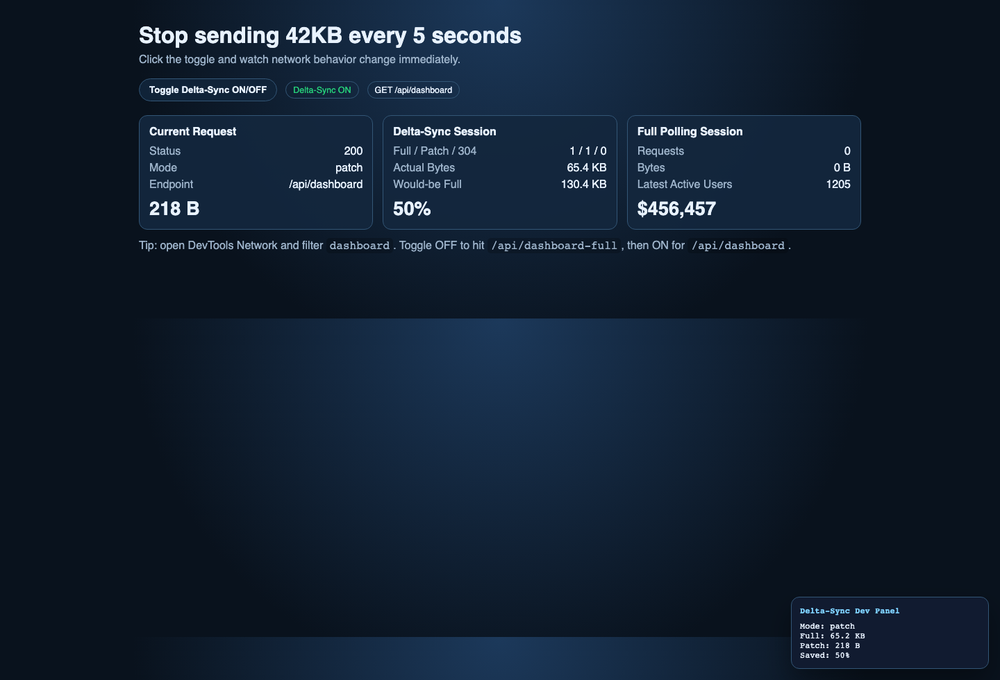
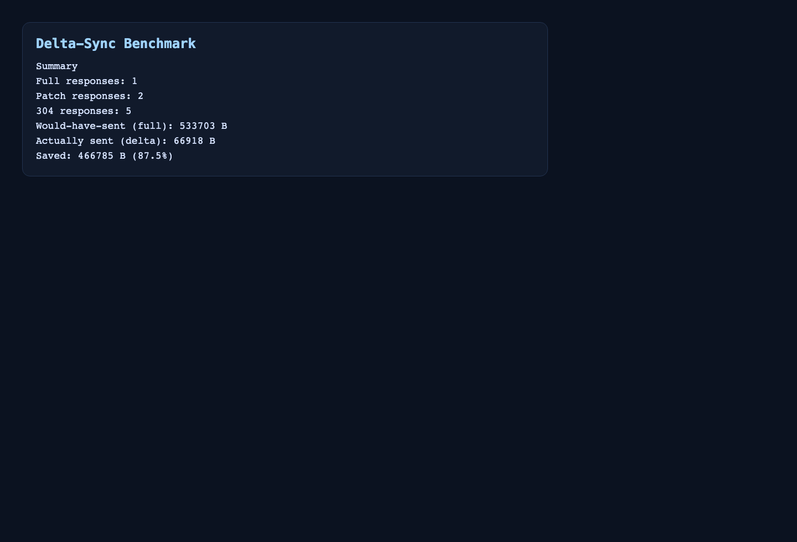

<p align="center">
  <picture>
    <source media="(prefers-color-scheme: dark)" srcset="docs/assets/logo-simple-b-dark.svg">
    
  </picture>
</p>

# Stop sending 42KB every 5 seconds

Delta-Sync reduces API bandwidth by 90-99% without WebSockets.

## Why Delta-Sync

- Keep polling and existing REST/GraphQL endpoints.
- Send full payload once, then JSON patch deltas.
- Return `304 Not Modified` when data is unchanged.
- Preserve standard HTTP semantics (`ETag`, `If-None-Match`, `Vary`).

## Demo (Instant Aha)

```bash
git clone https://github.com/your-org/delta-sync.git
cd delta-sync/examples/delta-sync-demo
npm install
npm run dev
```

Open `http://localhost:3000` and use `Toggle Delta-Sync ON/OFF`.

- `OFF` -> calls `/api/dashboard-full` (full payload every poll)
- `ON` -> calls `/api/dashboard` (full once, then patch/304)




## One-Line Integration

Server:

```ts
app.use('/api', deltaSync())
```

Client:

```ts
const { data } = useDeltaSync('/api/dashboard')
```

## Benchmark Proof

```text
Full: 1  Patch: 11  304: 8
Would have sent: 860.2 KB
Actually sent:    46.3 KB
Saved:           813.9 KB  (94.6%)
```



## Installation

```bash
npm install
npm run build
npm test
```

## Project Structure

- `src/middleware/deltaSync.ts` - server middleware
- `src/hooks/useDeltaSync.ts` - React polling hook
- `src/components/DeltaSyncDevPanel.tsx` - dev diagnostics panel
- `scripts/delta-benchmark.ts` - CLI benchmark
- `examples/delta-sync-demo` - drop-in visual demo
- `examples/graphql` - GraphQL polling integration
- `ports` - FastAPI, Gin, and Spring starters
- `docs/cdn-story.md` - CDN passthrough + edge roadmap

## HTTP Contract

- Request headers:
- `If-None-Match`
- `Accept: application/json-patch+json`

- Response headers:
- `ETag`
- `Vary: If-None-Match, Accept`
- `X-Delta-Sync: full | patch | full-fallback`
- `X-Delta-Full-Size`, `X-Delta-Patch-Size`

## GraphQL Integration

Use the same GraphQL query model and add Delta-Sync transport behavior:

- full on cold load
- patch on change
- 304 when unchanged

See `examples/graphql/README.md`.

## CDN Story

Delta-Sync works behind CDN today via ETag passthrough, with edge diff compute as the next optimization layer.

See `docs/cdn-story.md`.

## Language Ports

- Python FastAPI: `ports/fastapi-delta-sync`
- Go Gin: `ports/gin-delta-sync`
- Java Spring Boot: `ports/spring-delta-sync`

See `ports/README.md`.

## Testing

Core package:

```bash
npm test
npm run typecheck
```

Demo benchmark:

```bash
cd examples/delta-sync-demo
npm run benchmark -- http://localhost:3000 --polls 20 --interval 1000
```

## Roadmap

- Edge diff compute mode for ultra-low-latency revalidation
- Additional production adapters
- Broader language ports

## Documentation

- [Demo Guide](examples/delta-sync-demo/README.md)
- [GraphQL Guide](examples/graphql/README.md)
- [CDN Story](docs/cdn-story.md)
- [Language Ports](ports/README.md)
- [Contributing](CONTRIBUTING.md)
- [Security](SECURITY.md)
- [Code of Conduct](CODE_OF_CONDUCT.md)

## Community and OSS

- License: [MIT](LICENSE)
- Code of Conduct: [Contributor Covenant](CODE_OF_CONDUCT.md)
- Security policy: [SECURITY.md](SECURITY.md)
- Support: [SUPPORT.md](SUPPORT.md)

## License

MIT
