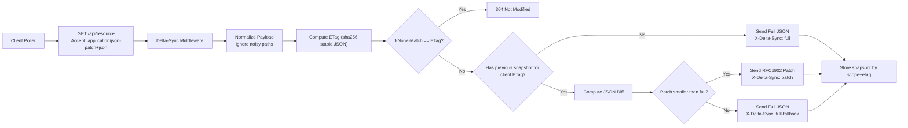

# Architecture

## High-level flow

## Components

- `src/middleware/deltaSync.ts`
- diff, ETag, patch/full decision
- `src/middleware/snapshotStore.ts`
- in-memory LRU and Redis adapters
- `src/hooks/useDeltaSync.ts`
- client polling + patch/full/304 handling
- `src/components/DeltaSyncDevPanel.tsx`
- developer diagnostics
